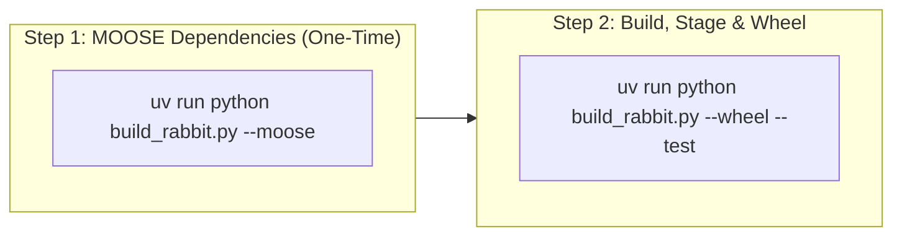

# rabbit-fem

`rabbit-fem` is a lightweight, standalone Python distribution of the [MOOSE](https://mooseframework.inl.gov/) (Multiphysics Object-Oriented Simulation Environment) finite element framework, tailored specifically for **thermal**, **solid mechanics**, and **contact** simulation.

Packaged as a self-contained Python wheel (~60 MB), `rabbit-fem` provides a drop-in `rabbit` command-line executable and Python dataset API that runs MOOSE simulations without requiring external MOOSE or libMesh system installations.

---

## Key Features

- **Focused Thermo-Mechanical Physics**: Preconfigured with `SolidMechanics`, `HeatTransfer`, `Contact`, `RayTracing`, and `ShiftedBoundaryMethod` modules.
- **Self-Contained & Relocatable**: Bundles stripped ELF binaries and shared libraries linked via `$ORIGIN` with zero external MOOSE dependency at runtime.
- **Drop-In CLI**: Execute MOOSE input files using `rabbit input.i` or `rabbit -i input.i`.
- **Packaged Simulation Datasets**: Includes standard benchmarks and Gmsh geometry scripts accessible directly through Python.
- **Zig Toolchain Orchestration**: Compiled and linked using `zig cc` / `zig c++` via `ziglang` and `build.zig`.

---

## Installation

Install `rabbit-fem` directly from the standalone wheel:

```bash
# Using pip
pip install dist/rabbit_fem-*.whl

# Using uv
uv pip install dist/rabbit_fem-*.whl
```


---

## Usage

### 1. Running Simulations with the `rabbit` CLI

Execute any MOOSE `.i` input file directly from your terminal:

```bash
# Run a packaged thermo-mechanical benchmark directly
rabbit -i $(python -c "from rabbit.sims import cube_thermomech_input_path, EElemType; print(cube_thermomech_input_path(EElemType.HEX8))")

# Or run any local MOOSE simulation
rabbit simulation.i
```

Run in parallel using OpenMPI:

```bash
mpirun -n 4 rabbit simulation.i
```

### 2. Python Dataset and Simulation Runner API

`rabbit-fem` packages simulation files and provides helpers to locate inputs, generate meshes with Gmsh, and execute solves:

```python
from rabbit.sims import (
    EElemType,
    cube_thermomech_input_path,
    run_rabbit,
)

# Locate packaged HEX8 thermo-mechanical cube input
input_file = cube_thermomech_input_path(EElemType.HEX8)

# Execute rabbit on the simulation
result = run_rabbit(input_file)
print("Simulation completed with return code:", result.returncode)
```

---

## Examples

Runnable example scripts demonstrating Gmsh mesh generation and MOOSE simulation execution are located in [`src/rabbit/examples/`](file:///home/lloydf/rabbit-fem/src/rabbit/examples/):

- [`ex0_cube.py`](file:///home/lloydf/rabbit-fem/src/rabbit/examples/ex0_cube.py) — 3D thermo-mechanical cube benchmark on structured HEX8 elements.
- [`ex1_dogbone.py`](file:///home/lloydf/rabbit-fem/src/rabbit/examples/ex1_dogbone.py) — 2D tensile dogbone mesh generation in Gmsh and linear elastic solve.
- [`ex2_tensile_plate.py`](file:///home/lloydf/rabbit-fem/src/rabbit/examples/ex2_tensile_plate.py) — 2D plate with a central hole mesh in Gmsh and elastic tension solve.
- [`ex3_stc_thermal.py`](file:///home/lloydf/rabbit-fem/src/rabbit/examples/ex3_stc_thermal.py) — 3D single thermal component (STC) with radiation and temperature-dependent conductivity.
- [`ex4_monoblock_thermomech.py`](file:///home/lloydf/rabbit-fem/src/rabbit/examples/ex4_monoblock_thermomech.py) — 3D monoblock fusion component mesh generation and coupled thermo-mechanical solve.

Run any example with:

```bash
uv run python src/rabbit/examples/ex0_cube.py
uv run python src/rabbit/examples/ex1_dogbone.py
```

---

## Build from Source

`rabbit-fem` can be built from source on both **Linux** (Ubuntu 22.04+ or compatible) and **native Windows** (x86_64).

---

### Windows Build & Testing

#### Prerequisites (Windows)

1. **Python 3.10+** (with [`uv`](https://docs.astral.sh/uv/)):
   ```powershell
   winget install astral-sh.uv
   ```
2. **Git Long Paths**:
   ```powershell
   git config --global core.longpaths true
   ```
3. **MSYS2** (used strictly for Unix shell utilities and GNU Make needed by PETSc/libMesh/MOOSE configure and build scripts; compilation itself is handled by Zig):
   ```powershell
   winget install --id MSYS2.MSYS2 --source winget
   C:\msys64\usr\bin\pacman.exe -S --needed --noconfirm make diffutils patch python m4 git
   ```

#### 1-Step Automated Windows Build

Run the automated PowerShell build script from the repository root:

```powershell
powershell -ExecutionPolicy Bypass -File scripts\install_dependencies_windows.ps1
```

This script:
- Creates and sets up `.venv` with `uv`.
- Installs Python dependencies (`ziglang==0.16.0`, `packaging`, `pyyaml`, `jinja2`, `pytest`, `gmsh`).
- Configures and builds **PETSc**, **libMesh**, **WASP**, and the **MOOSE** framework using the Zig C/C++ compiler.
- Compiles and links `rabbit-opt.exe` with Heat Transfer, Solid Mechanics, Contact, Ray Tracing, and Shifted Boundary Method.
- Stages `rabbit.exe` into `src/rabbit/bin/` and executes the simulation test suite.

#### Running Tests on Windows

Once the environment and binary are built, you can run the test suite in several ways:

1. **Using `uv run`** (Recommended):
   ```powershell
   uv run pytest test/test_simulations.py -v
   ```
   or using the build script:
   ```powershell
   uv run python build_rabbit.py --test
   ```

2. **Using `.venv` directly**:
   ```powershell
   $env:PYTHONPATH = "src"
   .\.venv\Scripts\python.exe -m pytest test/test_simulations.py -v
   ```

#### Building the Standalone Windows Wheel

To package the staged executable into a distributable wheel:

```powershell
uv run python build_rabbit.py --wheel-only --test
```

This generates `dist/rabbit_fem-2026.9.0-py3-none-win_amd64.whl` (~56 MB, fully self-contained).

---

### Linux Build & Testing

#### Prerequisites (Linux)

- **OS**: Linux x86_64 (Ubuntu 22.04+ or compatible)
- **System packages**: `build-essential`, `gfortran`, `libopenmpi-dev`, `openmpi-bin`, `patchelf`, `libtirpc-dev`, `libomp-dev`, `libglu1-mesa`
- **Python**: Python 3.10+ with [`uv`](https://docs.astral.sh/uv/)

```bash
sudo apt-get update && sudo apt-get install -y \
    build-essential gfortran libopenmpi-dev openmpi-bin patchelf libtirpc-dev libomp-dev libglu1-mesa

# Set up Python environment
uv venv .venv
source .venv/bin/activate
uv pip install -e ".[dev]"
```

#### The 2-Step Build Flow (Linux)



##### Step 1: Upstream MOOSE Dependencies (One-Time Setup)

Clones upstream MOOSE (if needed), compiles PETSc, libMesh, and WASP, and configures MOOSE:

```bash
uv run python build_rabbit.py --moose
```
*(Optionally pass a custom path: `--moose /path/to/moose`)*

##### Step 2: Build Rabbit, Stage Artifacts & Package Wheel

Compiles RabbitApp with the Zig toolchain, strips symbols, rewrites RPATHs with `patchelf`, packages the `.whl` into `dist/`, and runs tests:

```bash
uv run python build_rabbit.py --wheel --test
```

---

### `build_rabbit.py` Command Reference

| Command / Flag | Description |
|---|---|
| `uv run python build_rabbit.py --setup-wrappers` | Generate only the Zig CC/CXX wrapper toolchain scripts in `.zig_wrappers/` |
| `uv run python build_rabbit.py --moose [PATH]` | Build upstream MOOSE dependencies (PETSc, libMesh, WASP) |
| `uv run python build_rabbit.py` | Compile Rabbit and stage relocatable binaries in `src/rabbit/` |
| `uv run python build_rabbit.py --wheel` | Compile Rabbit, stage artifacts, and build wheel in `dist/` |
| `uv run python build_rabbit.py --wheel-only` | Package existing staged artifacts into `dist/*.whl` without recompiling |
| `uv run python build_rabbit.py --test` | Run pytest simulation and relocatability test suite (alias: `--tests`) |
| `uv run python build_rabbit.py --all` | Full pipeline: MOOSE build, Rabbit build, staging, wheel, and tests |

Alternatively, you can trigger the build using the Zig build system:

```bash
zig build
```


---

## License

`rabbit-fem` is distributed under the GNU Lesser General Public License v2.1 (LGPL-2.1), matching the MOOSE framework license. See [`LICENSE`](file:///home/lloydf/rabbit-fem/LICENSE) for details.
